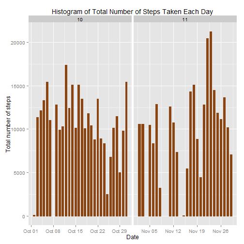
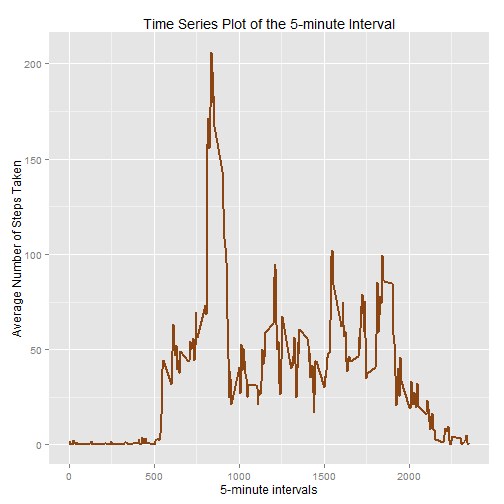
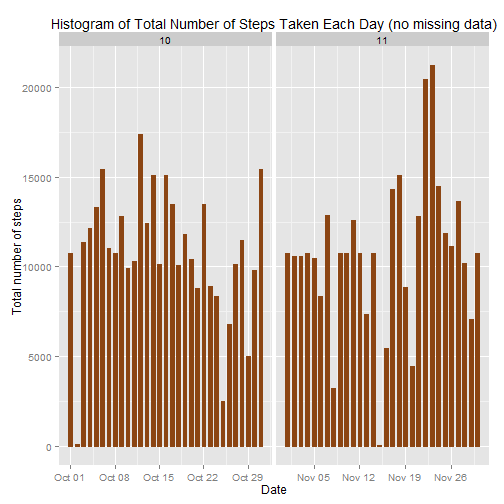
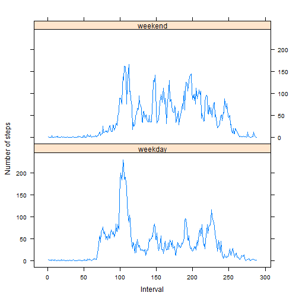

# Reproducible Research: Peer Assessment 1


by: <i><b>Nirmal Labh</b> [August 16, 2014]</i>


```r
# Making code visible per assignment requirement
echo = TRUE  
```


## Loading and preprocessing the data

 - Loading the data:


```r
unzip("activity.zip")
raw_data <- read.csv("activity.csv")
```

 - Processing/transforming the data into a format suitable for further analysis:


```r
# ignoring missing values in the data
data <- raw_data[!is.na(raw_data$steps),]
# convert string date data to Date type
data$date <- as.Date(data$date, "%Y-%m-%d")
# add 'month' column by extracting month from the date data
data$month <- as.numeric(format(data$date, "%m"))
# convert the 5-minute intervals to factor
data$interval <- as.factor(data$interval)
```


## What is mean total number of steps taken per day?

 - Histogram of the total number of steps taken each day:


```r
# supress warning about ggplot2 package built may be on a different
# minor version of R than the version of R in use to load and use it
options(warn=-1)

library(ggplot2)

# re-enable warnings so something important is not ignored
options(warn=0)

library(ggplot2)
options(warn=-1)

# using colors in plots from list here: http://sape.inf.usi.ch/quick-reference/ggplot2/colour
g <- ggplot(data, aes(date, steps)) 
g <- g + geom_bar(stat = "identity", colour = "chocolate4", fill = "chocolate4", width = 0.6)  
g <- g + labs(title = "Histogram of Total Number of Steps Taken Each Day")
g <- g + labs(x = "Date", y = "Total number of steps") 
g <- g + facet_grid(. ~ month, scales = "free")
print(g)
```

 

 - Calculating <b>mean</b> and <b>median</b> total numbers of steps taken per day:


```r
mean(aggregate(data$steps,by=list(Date=data$date), FUN=sum)$x)
```

```
## [1] 10766
```

```r
median(aggregate(data$steps,by=list(Date=data$date), FUN=sum)$x)
```

```
## [1] 10765
```


## What is the average daily activity pattern?

 -  Time series plot (i.e. type = "l") of the 5-minute interval (x-axis) and the average number of steps taken, averaged across all days (y-axis)


```r
avgDailyPattern <- aggregate(data$steps,by=list(interval=as.numeric(as.character(data$interval))), FUN=mean)
```


```r
ag <- ggplot(avgDailyPattern, aes(interval, x)) 
ag <- ag + geom_line(color = "chocolate4", size = 0.8) 
ag <- ag + labs(title = "Time Series Plot of the 5-minute Interval")
ag <- ag + labs(x = "5-minute intervals", y = "Average Number of Steps Taken")
print(ag)
```

 

 -  The 5-minute interval, on average across all the days in the dataset, containing the maximum number of steps:


```r
names(avgDailyPattern)[2] <- "meanAcrossDays"
avgDailyPattern[which(avgDailyPattern$meanAcrossDays == max(avgDailyPattern$meanAcrossDays)),]
```

```
##     interval meanAcrossDays
## 104      835          206.2
```

## Imputing missing values

  - Total number of missing values in the dataset (i.e. the total number of rows with NAs)


```r
sum(is.na(raw_data$steps))
```

```
## [1] 2304
```

  - Strategy for filling in all of the missing values in the dataset: <i><b>Using the mean of 5-minute intervals calculated earlier in 'avgDailyPattern' as estimate of missing values.</b></i>
  

    Converting intervals as factor so we can match with the average data based on interval in the next step.

```r
raw_data$interval <- as.factor(raw_data$interval)
```


  - Creating a new dataset that is equal to the original dataset but with the missing data filled in.


```r
new_data <- raw_data
new_data[is.na(new_data$steps),]$steps <- avgDailyPattern[new_data[
is.na(new_data$steps),]$interval
,]$meanAcrossDays
```

  - Verifying there is no more missing data:


```r
sum(is.na(new_data$steps))
```

```
## [1] 0
```


  - Making histogram of the total number of steps taken each day:


```r
new_data$date <- as.Date(new_data$date, "%Y-%m-%d")
new_data$month <- as.numeric(format(new_data$date, "%m"))
gn <- ggplot(new_data, aes(date, steps))
gn <- gn + geom_bar(stat = "identity", colour = "chocolate4", fill = "chocolate4", width = 0.6)
gn <- gn + facet_grid(. ~ month, scales = "free")
gn <- gn + labs(title = "Histogram of Total Number of Steps Taken Each Day (no missing data)")
gn <- gn + labs(x = "Date", y = "Total number of steps")
print(gn)
```

 

  - Calculating new <b>mean</b> and <b>median</b> total numbers of steps taken per day:


```r
mean(aggregate(new_data$steps,by=list(Date=new_data$date), FUN=sum)$x)
```

```
## [1] 10766
```

```r
median(aggregate(new_data$steps,by=list(Date=new_data$date), FUN=sum)$x)
```

```
## [1] 10766
```

 - These values do not really differ from the estimates from the first part of the assignment. The impact of imputing missing data on the estimates of the total daily number of steps is not significant.


## Are there differences in activity patterns between weekdays and weekends?

- Create a new factor variable in the dataset with two levels - "weekday" and "weekend" indicating whether a given date is a weekday or weekend day.


```r
# grepl will return 1 for a match (i.e. weekend) and 0 for no match
# add a '1' to get appropriate index into the vector
new_data$weekdays <- c('weekday','weekend')[grepl("Saturday|Sunday", weekdays(new_data$date))+1]
new_data$weekdays <- as.factor(new_data$weekdays)
```

- Verify the new column/variable


```r
levels(new_data$weekdays)
```

```
## [1] "weekday" "weekend"
```

```r
table(new_data$weekdays)
```

```
## 
## weekday weekend 
##   12960    4608
```

- Making the panel plot containing a time series plot (i.e. type = "l") of the 5-minute interval (x-axis) and the average number of steps taken, averaged across all weekday days or weekend days (y-axis):


```r
# calculate average steps, across all weekday days or weekend days
avgNumSteps <- aggregate(new_data$steps, 
                      by=list(interval = as.numeric(new_data$interval), 
                              weekdays = new_data$weekdays),
                       FUN = "mean")
names(avgNumSteps)[3] <- "meanNumSteps"
# create plot for the above calculated averages
library(lattice)
xyplot(avgNumSteps$meanNumSteps ~ avgNumSteps$interval | avgNumSteps$weekdays, 
       layout = c(1, 2), type = "l", 
       xlab = "Interval", ylab = "Number of steps")
```

 
